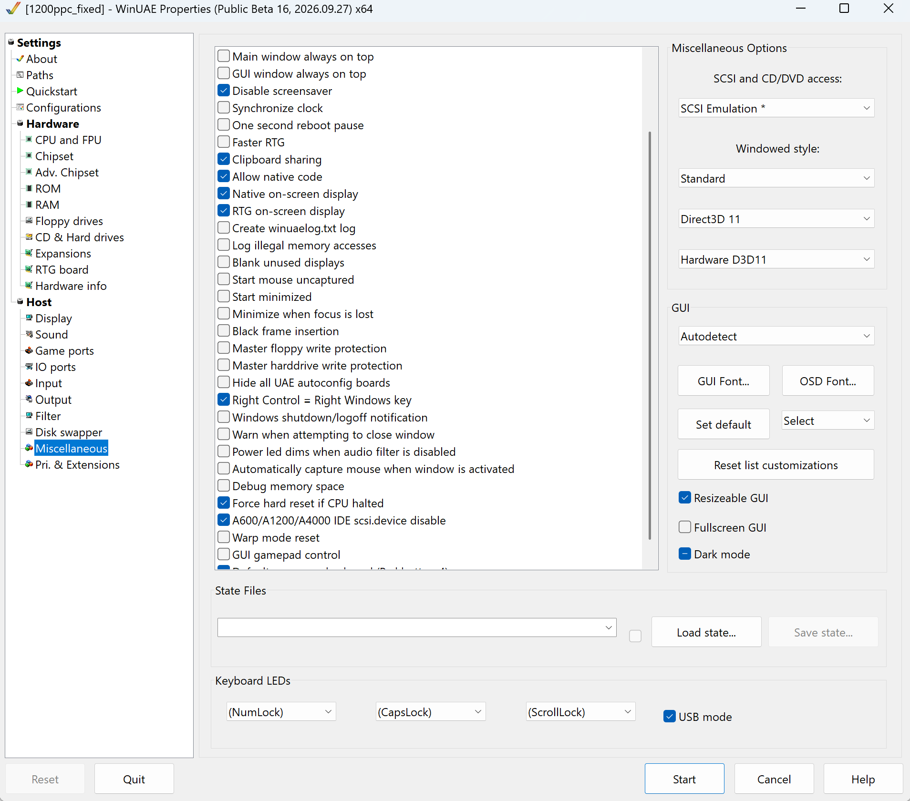

# QuarkTex NG

**Hardware-accelerated 3D for AmigaOS in WinUAE.** Warp3D, StormMESA (agl)
and MiniGL programs running in the emulated Amiga draw with the PC's
graphics card through OpenGL, instead of the emulated CPU drawing every
pixel in software.

QuarkTex NG is an independent continuation of
[QuarkTex](https://github.com/RobDangerous/QuarkTex), the 3D virtualization
solution Robert Konrad released in 2003 (last version 0.53). It keeps its
license, the GNU LGPL v3, and its idea, and rebuilds the rest: a 64-bit
capable host library, a command buffer instead of one emulator call per
OpenGL function, a modern OpenGL 3.3 renderer for Warp3D, a new
minigl.library, and frames written into Amiga display memory so they show
in fullscreen too.

Status: **1.0 beta**, in development.

## What's new compared to QuarkTex 0.53

| | QuarkTex 0.53 (2003) | QuarkTex NG 1.0 beta |
| --- | --- | --- |
| WinUAE | 32-bit only (old uaelib traps) | 32-bit and **64-bit** (native code interface) |
| Host communication | one emulator call per OpenGL function | commands batched in a buffer |
| Warp3D | drawn from the 68k, vertex by vertex, OpenGL 1.1 | drawn on the host, batched, OpenGL 3.3 core |
| APIs | Warp3D, StormMESA | Warp3D, StormMESA, **MiniGL** (new minigl.library) |
| Display | a host window over the emulator: windowed mode only | frames written into Amiga RTG memory: window, full window and **fullscreen**, with WinUAE's scaling, filters and recording |
| Stencil buffer, chroma key, mipmaps | missing | supported |
| Several 3D contexts at once | no | yes |
| Fog | drawn black | correct |
| Paletted textures, texture colours, texture updates | wrong | correct |
| Z-buffer reads and writes | garbage | correct |
| W3D_Query | "fully supported" for nearly everything | what the renderer really does |
| Memory leaks | textures leaked on context close | freed |
| Build and tests | StormC 4, Visual Studio 2008, no tests | GCC and CMake in Docker; automated pixel-by-pixel tests against 0.53, unit tests |

## Performance

Test system: Intel Iris Xe graphics, WinUAE 6.0.3 and 6.x betas, AmigaOS
3.2, 68040/68060 at `cpu_speed=max`.

### Warp3D: 1.2 million triangles (test t09_throughput)

| Version | JIT off | JIT on |
| --- | --- | --- |
| QuarkTex 0.53, 32-bit WinUAE | 3.23 s | 1.34 s |
| QuarkTex NG, 32-bit WinUAE | 1.92 s (40 % less) | **0.39 s (3.4× faster)** |
| QuarkTex NG, 64-bit WinUAE | 1.83 s (44 % less) | **0.44 s (3.1× faster)** |

Time the host spends drawing 60,000 triangles:

| Renderer | Host time | Triangles per second |
| --- | --- | --- |
| OpenGL 1.1, one call per vertex attribute | 27-29 ms | 2.6-2.8 million |
| OpenGL 3.3 core, batched | **10 ms** | **5.9-6.3 million** |

### MiniGL: Return to Castle Wolfenstein

640 × 480, the game's frame cap off (`com_maxfps 0`), level escape1.
QuarkTex 0.53 had no MiniGL, so the reference is MiniGL Classic on Warp3D.

| Path | fps |
| --- | --- |
| MiniGL Classic + Warp3D | 157 |
| QuarkTex NG minigl.library, first version (vertex arrays on the 68k) | 111 |
| QuarkTex NG minigl.library, vertex arrays on the host | 188 (windowed only) |
| QuarkTex NG minigl.library, fullscreen-capable, asynchronous presenting | **~170** (window, full window and fullscreen) |

| Per frame | Before | Now |
| --- | --- | --- |
| Commands from the 68k to the host | 1.37 MB | **22 KB** |
| Showing the frame in Amiga display memory | 2.7 ms | **0.33 ms** |

At these rates RTCW is limited by the emulated 68k; a faster PC CPU goes
higher. Capped at its usual 60 fps the game runs at its cap. Jedi Knight II
runs at its own 90 fps cap.

### Games tested

| Game | API | Result |
| --- | --- | --- |
| Return to Castle Wolfenstein | MiniGL | menus and levels, multitexture lightmaps |
| Star Wars Jedi Knight II | MiniGL | intro, cutscenes with lip sync, levels |
| OpenLara (Tomb Raider) | MiniGL | intro videos, menu, levels |
| Hurrican | MiniGL | cracktro, menu, levels |

## Requirements

- Windows with a graphics card and driver for OpenGL 3.3.
- WinUAE (tested with 6.0.3 and the 6.x public betas), 32-bit or 64-bit.
- AmigaOS 3.x with an RTG board (uaegfx) and Picasso96, a 68020 or better
  with FPU (68040/68060 recommended).

## Installation

1. Copy `quarktexng-windows-x86.dll` and `quarktexng-windows-x86-64.dll` into
   the WinUAE directory (or its `plugins` directory). Older
   `quarktex-windows-*.dll` files are not used any more.
2. Copy `Warp3D.library`, `agl.library` (StormMESA) and `minigl.library`
   (MiniGL) to `LIBS:` in AmigaOS. The libraries and the DLLs belong
   together: a library of one release does not work with a DLL of another.
3. Set up WinUAE as below.

## WinUAE settings

Two settings are **required**; the others are what QuarkTex NG was tested
and measured with. Each is given as it appears in WinUAE's settings window
and as the line in a `.uae` configuration file.

### 1. Allow native code (required)

**Settings → Host → Miscellaneous → Allow native code**
(`native_code=true`). The Amiga libraries reach the host DLL through
WinUAE's native code interface; without it Warp3D, StormMESA and MiniGL
programs find no driver.



### 2. CPU, FPU and JIT (Settings → Hardware → CPU and FPU)

| Setting | Value | Configuration file | |
| --- | --- | --- | --- |
| CPU | 68040 or 68060 | `cpu_type=68060`, `cpu_model=68060` | recommended |
| CPU speed | **Fastest possible** | `cpu_speed=max` | recommended |
| FPU | **CPU internal** (the 68040's or 68060's own FPU) | `fpu_model=68060` | required: the libraries are built for a 68020-68060 with FPU |
| FPU precision | **Host (80-bit)** | `fpu_msvc_long_double=true` | **required** |
| JIT | **on** | | strongly recommended |
| JIT cache size | **16 MB** (slider at its maximum) | `cachesize=16384` | strongly recommended |
| JIT FPU support | **on** | `compfpu=true` | strongly recommended |
| More compatible | off | `cpu_compatible=false`, `fpu_strict=false` | |

Why these matter:

- **FPU precision: Host (80-bit).** A real 68881, 68040 or 68060 FPU
  computes with 80-bit extended precision. WinUAE's default, *Host
  (64-bit)*, uses 64-bit doubles, and the games then compute values a real
  Amiga does not: in Jedi Knight II the first person weapon never appears,
  in Return to Castle Wolfenstein it disappears during play (their matrices
  become NaN). With *Host (80-bit)* both show. QuarkTex NG checks the
  precision when a library opens: minigl.library shows a requester, and all
  three libraries write a warning into `QuarkTexNGLog.txt`. *Softfloat
  (80-bit)* is precise too, but WinUAE cannot combine it with the JIT's FPU
  support, so it is much slower.
- **JIT and JIT FPU support.** The 3D work runs on the PC, but the game
  itself still runs on the emulated 68k; that is where the frame time goes
  (RTCW: about 4.8 ms of a 5.9 ms frame). With the JIT's FPU support turned
  off, Jedi Knight II fell from its 90 fps cap to about 15 fps. *Host
  (80-bit)* keeps working with the JIT FPU on.
- **JIT cache size.** Large games such as RTCW and Jedi Knight II run a lot
  of 68k code; the largest cache (16 MB) keeps it translated.

### 3. RTG board, display and memory

| Setting | Where in WinUAE | Configuration file | |
| --- | --- | --- | --- |
| RTG board | Hardware → RTG board: UAE Zorro III, 64 MB or more | `gfxcard_type=ZorroIII`, `gfxcard_size=64` | required for fullscreen |
| Display | Host → Display: window, full window or fullscreen | `gfx_fullscreen_picasso=true` or `fullwindow` | all three work |
| Z3 Fast RAM | Hardware → RAM: 256 MB or more for large games | `z3mem_size=512` | recommended |
| Sound | Host → Sound enabled; AHI with WinUAE's `uae.audio` driver | `sound_output=exact` | for the games' sound and lip sync |

QuarkTex NG writes each frame into the Amiga's RTG display memory, in the
screen's own format (15-, 16-, 24- and 32-bit modes), so WinUAE shows it like
any other Amiga graphics, scaled and filtered with the rest of the display.
Fullscreen screens get the display mode of their size from Picasso96, so a
game's 1024 × 768 screen opens in a 1024 × 768 mode. On planar or 8-bit
(CLUT) screens QuarkTex NG falls back to drawing in a host window, which
shows only while WinUAE runs in a window.

## Known issues

- MiniGL Classic (the Warp3D-based minigl.library) in fullscreen crashes on
  QuarkTex NG's Warp3D. QuarkTex NG's own minigl.library runs the same games.
- The rotating passport in OpenLara's menu draws dark.
- As in 0.53, a library is not meant to be used by two tasks drawing at the
  same time.

## Building

Everything builds in Docker; Docker and a POSIX shell (Git Bash on Windows)
are all that is needed:

```sh
./build.sh            # everything, collected in dist/
./build.sh amiga      # Warp3D.library, agl.library; minigl.library when MINIGL_SDK is set
./build.sh host       # quarktexng-windows-x86.dll and -x86-64.dll (MinGW-w64)
./build.sh tests      # test programs, see tests/README.md
./build.sh unittest   # the OpenGL command buffer encoder/decoder on the build host
./build.sh generate   # regenerate gl/*.auto.* after editing gl/glFuncs.txt
```

`minigl.library` needs MiniGL's SDK headers, which are not part of this
repository (they are under the Hyperion MiniGL Open Source License):
`MINIGL_SDK=<sdk>/dev/include ./build.sh amiga`.

The host DLLs also build with Visual Studio 2022:
`cmake -S . -B build/host-x64 -A x64` and `cmake --build build/host-x64 --config Release`
(`-A Win32` for the 32-bit DLL).

The product name and version are set in one place, `PRODUCT` in
`amiga/Makefile`.

## Tests

`tests/run.ps1` runs reference programs (Warp3D and StormMESA) in a
portable copy of WinUAE, once with QuarkTex 0.53 and once with the current
build, and compares the frames pixel by pixel; differences that are fixes
are listed in `tests/known-differences.txt`. Each test also reports what the
Amiga display shows. `tests/run-app.ps1` runs any Amiga program in that
WinUAE, with frame capture, profiling (`-Profile`), command tracing
(`-TraceFrame`), fullscreen modes and extra WinUAE options. See
[tests/README.md](tests/README.md).

## Repository layout

| Directory | Contents |
| --- | --- |
| `Warp3D.library/` | Warp3D 4 API on the host renderer (68k) |
| `agl.library/` | StormMESA API on OpenGL (68k) |
| `minigl.library/` | MiniGL's shared library interface on OpenGL (68k) |
| `gl/` | 68k bridge to the host, partly generated from `glFuncs.txt` |
| `amiga/` | library skeleton and build files for the 68k side |
| `host/` | host DLL: OpenGL contexts, Warp3D renderer, presenting into Amiga memory |
| `tests/` | reference tests, self-checking tests, WinUAE scripts |
| `docs/` | design notes for each phase of the work |

## License and credits

- **QuarkTex** © 2003–2012 Robert Konrad, released under the GNU Lesser
  General Public License version 3.
- **QuarkTex NG**, changes and additions since 2026 © Serkan DURSUN,
  released under the same license. QuarkTex NG is a modified version of
  QuarkTex; its changes are recorded in the git history and in `docs/`. It
  is not made or endorsed by the original author.

The license texts: [License.txt](License.txt) (GNU LGPL v3) and
[COPYING](COPYING) (GNU GPL v3, on which the LGPL v3 builds).

Third-party files in this repository keep their own terms:

- `Warp3D.library/Warp3D.h`, `Warp3D.library/Warp3D.fd`: Warp3D API
  include files, © 1998 Sam Jordan, Hans-Jörg Frieden, Thomas Frieden,
  used for compatibility with the Warp3D API.
- `agl.library/Amigamesa.h`: from Mesa 1.2, © 1995 Brian Paul, GNU Library
  General Public License version 2 or later.

MiniGL's SDK is not included; building `minigl.library` reads its headers,
which are © Hyperion under the Hyperion MiniGL Open Source License.
